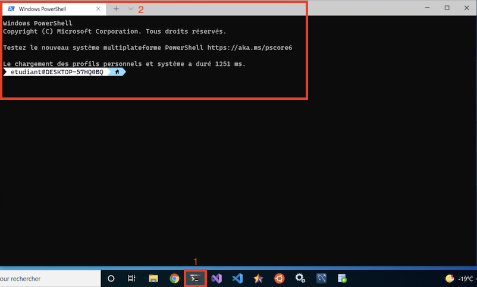
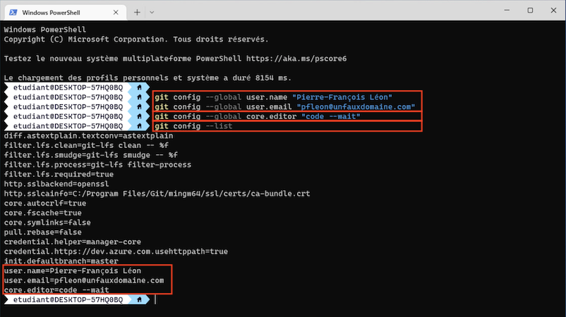

# Création d'un compte GitHub et Configurer votre client Git

## Objectifs

Les objectifs de cette étape sont :

- De vous créer un compte sur le site [GitHub](https://github.com)
- De configurer votre client Git aussi bien sur votre machine virtuelle (VM) que votre machine personnelle.

## Exercice 1 - Création de votre compte GitHub

**Si vous avez déjà un compte sur le site GitHub, vous pouvez sauter cet exercice.**

- Ouvrez un nouvel onglet dans votre navigateur
- Allez sur l'adresse [https://www.github.com](https://www.github.com)
- Cliquez sur le bouton "Sign up" qui se situe en haut à droite de la page
- Suivez les instructions qui se résument à :
  - Entrez votre adresse courriel (attention à l'adresse courriel que vous allez utiliser, vous pourriez vouloir garder votre compte pour vous en servir de démonstration plus tard)
  - Choisissez et entrez un mot de passe
  - Choisissez et entrez un nom d'utilisateur (Même remarque que pour votre adresse courriel)
  - Fournissez un choix sur le droit ou non de GitHub à vous envoyer de la publicité ciblée
  - Prouvez au robot du site web de GitHub que vous êtes un humain (?!)
  - Entrez le code de vérification que vous avez reçu par courriel
  - Cliquez sur "Skip personalization"
- Vous êtes maintenant inscrit ! Bienvenue sur GitHub !

## Exercice 2 - Configurez votre client Git sur votre machine virtuelle

- Connectez-vous à votre machine virtuelle. Si vous ne savez plus comment faire, [consultez cette page](CONNEXION_VM.md).
- [Lancez un invite de commande](LIGNE_COMMANDE.md) ou l'application "Windows Terminal"



- Tapez les commandes suivantes en utilisant l'adresse courriel que vous avez utilisée pour créer votre compte GitHub (Remplacez <Prénom> par votre prénom, etc. (donc enlevez les <>)) :

```bash
git config --global user.name "<Prénom> <Nom>"
git config --global user.email "<adresse_courriel>"
```

Exemple :

```bash
git config --global user.name "Pierre-François Léon"
git config --global user.email "pfleon@unfauxdomaine.com"
```

- Tapez les commandes suivantes pour changer l'éditeur par défaut de utilisé par git qui est vi (croyez-moi, vous ne voulez pas débuter avec cet éditeur, même s'il est très très pratique) pour Visual Code :

```bash
git config --global core.editor "code --wait"
```

- Validez que vous avez bien configuré votre client git avec la commande ```git config --list```. Si les informations sont incorrectes, vous devrez les corriger en retapant les commandes précédentes.



**Un fois que vous aurez installé les logiciels de développement sur votre machine personnelle, cette partie, "Configurez votre client Git", sera à refaire.**

## Exercice 3 - Configurez votre client Git sur votre machine personnelle

- Refaite les mêmes étapes que précédemment, mais sur votre machine personnelle.

[Retour à la page principale](README.md)
