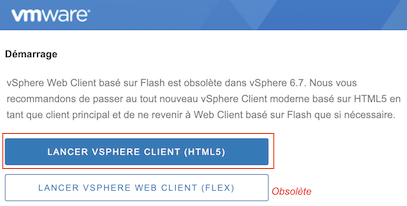
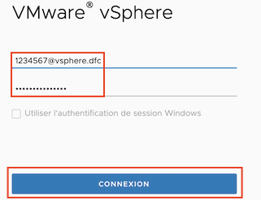

# Connexion à la machine virtuelle de la formation continue du Cégep de Sainte-Foy

- Naviguez l'URL : https://vcenterdfc.csfoy.qc.ca
- Si un message d'erreur s'affiche disant que le site n'est pas sécuritaire, ignorez le message et continuez.
- Choisissez l'option "Lancer VSPHERE Client (HTML5)" 

- Tapez votre nom d'utilisateur (<numéroMatricule>@vsphere.dfc) et votre mot de passe et cliquez sur "Connexion"

- Une fois connecté, cliquez sur l'icône en forme de feuille de papier et naviguez l'arborescence des éléments affichés pour afficher votre répertoire personnel en passant par les niveaux "DFC DS > VM DFC > H22_S1_4394_Gen > <numéroMatricule>"
- Cliquez sur la seule VM qui se trouve dans ce répertoire
- Démarrez la VM si ce n'est pas déjà fait avec le bouton en forme de triangle vert (il est grisé si elle est déjà démarrée)
- Si vous êtes en dehors des murs du cégep, cliquez sur le lien "lancer la console Web". Si vous êtes connectés au réseau local du Cégep, utilisez le bouton "lancer Remote console" qui sera beaucoup plus agréable (Si vous n'avez pas l'application cliente installée, suivez les instructions qui s'affiche dans le dialogue).
- Connectez-vous l'utilisateur "etudiant" avec le mot de passe que vous avez déjà choisi. Si c'est votre première connexion, utilisez le mot de passe que vous fournira votre enseignant.

[Retour à la page principale](README.md)
