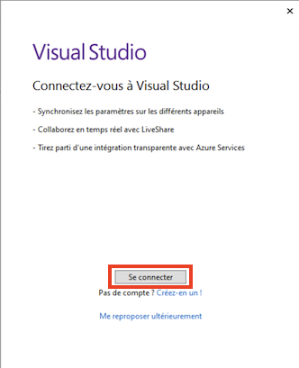
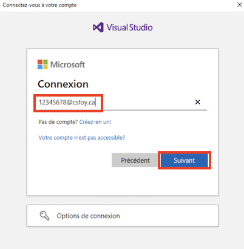
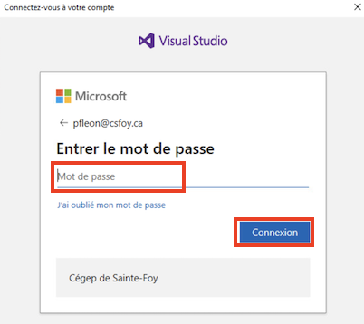

# Connexion à votre compte Microsoft pour Visual Studio

- Si Visual Studio vous propose de vous connecter, cliquez sur le bouton "Se connecter"

- Entrez votre nom d'utilisateur du Cégep de Sainte-Foy sous la forme <numéroMatricule>@csfoy.ca :

- Entrez votre mot de passe du Cégep de Sainte-Foy (Même que celui que vous utilisez pour Omnivox) :

[Retour à la page principale](README.md)
