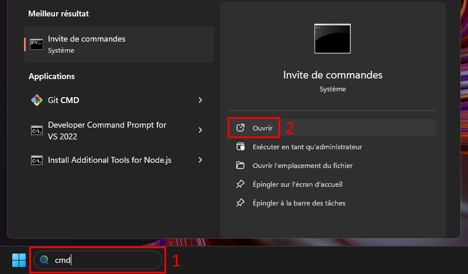

# Ouverture d'une ligne de commande
Faites un clic droit sur le menu _"Démarrer"_ et choisissez _"Exécuter"_. Vous pouvez aussi faire le raccourci ```[Win]``` + ```r```


Entrez ```cmd``` à droite du label _"Ouvrir :"_


Vous pouvez aussi accéder à l'invite de commandes depuis la zone de recherche



Vous avez maintenant une fenêtre de commande ouverte !


**Si vous souhaitez avoir un invite de commande plus agréable, vous pouvez installer l'application [Windows Terminal](https://www.microsoft.com/store/productId/9N0DX20HK701?ocid=pdpshare) depuis le Windows Store ou en copiant cette ligne dans un invite de commande :**
```bash
winget install Microsoft.WindowsTerminal
```

[Retour à la page principale](README.md)
