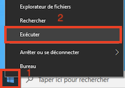
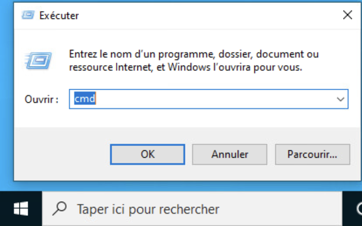
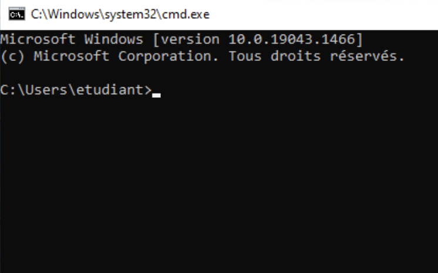

# Ouverture d'une ligne de commande

- Faites un clic droit sur le menu "Windows" et choisissez "Exécuter" ou appuyez sur la combinaison de touches "[Win] + R"



- Entrez ```cmd``` à droite du label "Ouvrir :"



Vous avez maintenant une fenêtre de commande ouverte !



**Si vous voulez avoir un invite de commande plus agréable, vous pouvez installer l'application "Windows Terminal" à partir du Windows Store.**

[Retour à la page principale](README.md)
