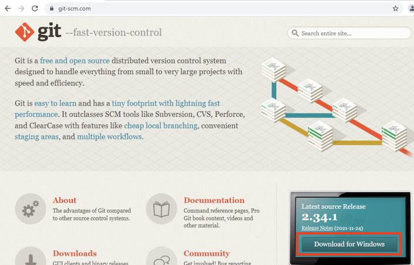
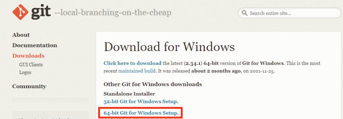
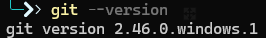
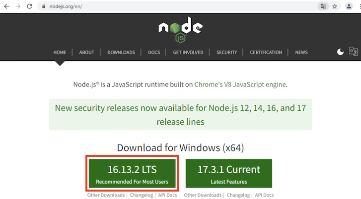
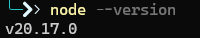
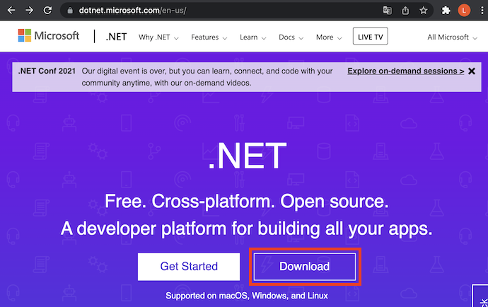
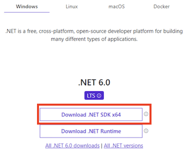
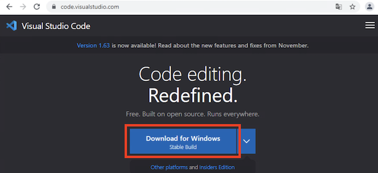
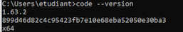
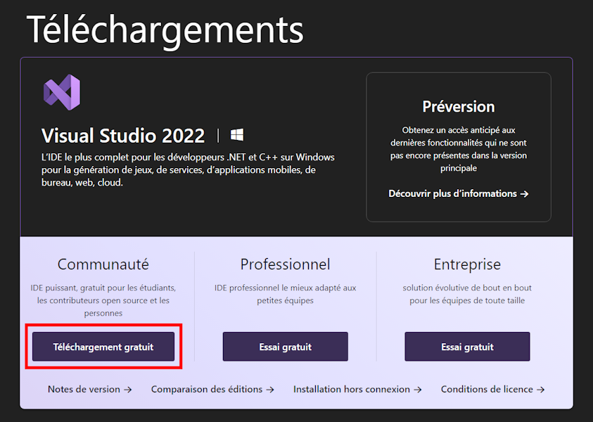

# Installation des logiciels de développement

## Objectifs

L'objectif de cette partie est d'installer les outils suivants sur votre machine :

- Git
- Node.js
- Dotnet 6.0
- Visual Studio Code
- Visual Studio 2022

Nous supposons ici que votre machine personnelle est/a :

- Un PC tournant sous Windows 10
- Un minimum de 8Go de mémoire vive
- Un minimum de 40Go d'espace disque libre
- Les outils ne sont pas pré-installés

## Exercice 1 - Installation de Git

- Naviguez le site [https://git-scm.com](https://git-scm.com)
- Cliquez sur le bouton "Download for Windows"



- Téléchargez le logiciel Git en choisissant la version correspondant à votre machine, normalement la version 64 bits.



- Lancez le programme d'installation que vous venez de télécharger
- Suivez les instructions et optez pour les valeurs par défaut
- Une fois l'installation terminée, [Ouvrez un invite de commande](LIGNE_COMMANDE.md) et validez qu'en tapant ```git --version``` vous obtenez la version de Git installée (la version peut varier) :



## Exercice 2 - Installation de Node.js

- Naviguez le site [https://nodejs.org](https://nodejs.org)
- Choisissez le lien qui permet de télécharger la version LTS (Long Term Support) de Node.js.



- Lancez le programme d'installation que vous venez de télécharger
- Suivez les instructions et optez pour les valeurs par défaut
- Une fois l'installation terminée, [Ouvrez un invite de commande](LIGNE_COMMANDE.md) et validez qu'en tapant ```node --version``` vous obtenez la version de Node.js installée (la version peut varier) :



## Exercice 3 - Installation de Dotnet 6.0

- Naviguez le site [https://dotnet.microsoft.com](https://dotnet.microsoft.com)
- Cliquez sur le bouton "Download"



- Validez que le site affiche bien la version 6.0.
- Choisissez le lien "Download .NET SDK x64" (notez que la version proposée est aussi la version LTS)



- Lancez le programme d'installation que vous venez de télécharger.
- Suivez les instructions et optez pour les valeurs par défaut
- Une fois l'installation terminée, [Ouvrez un invite de commande](LIGNE_COMMANDE.md) et validez qu'en tapant ```dotnet --version``` vous obtenez la version de dotnet installée (la version peut varier) :


## Exercice 4 - Installation de Visual Studio Code

- Naviguez le site [https://code.visualstudio.com](https://code.visualstudio.com)
- Cliquez sur le bouton "Download for Windows"



- Lancez le programme d'installation que vous venez de télécharger
- Suivez les instructions et optez pour les valeurs par défaut
- Une fois l'installation terminée, [Ouvrez un invite de commande](LIGNE_COMMANDE.md) et validez qu'en tapant ```code --version``` vous obtenez la version de Visual Studio Code installée (la version peut varier) :



## Exercice 5 - Installation de Visual Studio 2022

- Naviguez le site [https://visualstudio.microsoft.com](https://visualstudio.microsoft.com)
- Cherchez le bouton "Télécharger Visual Studio" et choisissez l'option "Community 2022".



- Lancez le programme d'installation que vous venez de télécharger.
- Suivez les instructions jusqu'à arriver à la fenêtre des "Détails de l'installation"
- Dans cette fenêtre, cochez les options suivantes :
  - Développement web et ASP.NET
  - Développement Node.js
  - Développement .NET Desktop


- Cliquez sur le bouton "Installer"
- N'attendez pas la fin de l'installation (plusieurs dizaines minutes suivant votre configuration matérielle et réseau !) pour continuer les exercices en retournant sur la page principale des exercices.

[Retour à la page principale](README.md)
